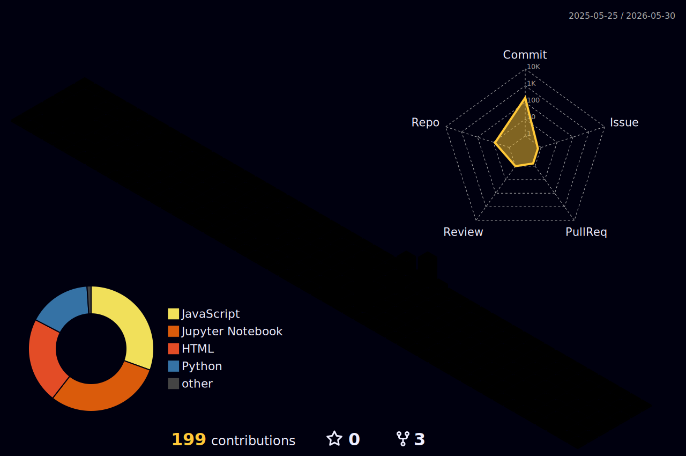

<h2 align="left">Hi 👋! My name is Himanshu and I'm an Engineering Student.</h2>

<h3 align="center">📊 My GitHub Activity</h3>

  

###

  <!--  -->
  
  

###

###

  
  
  
  
  
  
  
  
  
  
  
  
  
  
  
  
  
  
  
  
  
  
  
  
  
  
  
  
  
  
  
  
  
  
  
  
  
  
  
  
  
  
  
  
  

###

  

  

  

  

  

###

<!-- Final Row: Snake and LeetCode side-by-side -->

  <table>
    <tr>
      <td width=75% height=200>
        <h4>🔥 My Streaks: </h4>
        
      </td>
      <td>
        <h4>🏆 Leetcode Profile</h4>
        
      </td>
    </tr>
  </table>

 

<h3 align="center">🏅 My Holopin Badges</h3>

  

